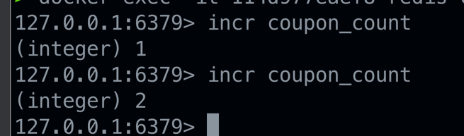

### 문제점

- 아래 테스트 코드를 실행시 문제가 발생한다.
    - 아래 서비스 로직에서 100 개가 넘을 경우, 종료된다.

```java
    public void apply(Long userId) {
        long count = couponRepository.count();

        if(count>100){
            return;
        }

        couponRepository.save(new Coupon(userId));
    }
```

### 테스트 코드

```java
@Test
public void 여러명응모()throws InterruptedException{
    int threadCount=110;  // 실제와 유사한 환경을 모방하도록 스레드 수 조정

    // multiThread (병렬 작업을 도와주는 Java api)
    ExecutorService executorService=Executors.newFixedThreadPool(10); // 연결 풀 크기에 맞춘 스레드 풀 크기

    // 모든 요청이 끝날때 까지 기다림 ( 다른 스레드에서 수행하는 작업을 기다려주도록 도와주는 class )
    CountDownLatch latch=new CountDownLatch(threadCount);

    for(int i = 0; i < threadCount; i++) {
        long userId=i;
        
        executorService.submit(()-> {
          try {
              applyService.apply(userId);
          } finally {
              latch.countDown();
          }
      });
    }

    latch.await();  // 모든 스레드의 작업 완료를 기다림

    executorService.shutdown();  // 스레드 풀 종료

    long count = couponRepository.count();  // 모든 적용이 완료된 후에 쿠폰 수 검사

    assertThat(count).isEqualTo(100);  // 비즈니스 로직에서 제한했던 쿠폰 응모수 100개와 일치하는지
}
```

### 문제점

- 레이즈 컨디션 때문에 테스트가 실패한다.

> 레이즈 컨디션이란 두개이상의 쓰레드가 공유 데이터에 엑세스를 하고 동시에 작업을 하려고 할때 발생하는 문제이다.

### 예시 (예상 시나리오)

| Thread-1                    | Coupon count | Thread-2                    |
|-----------------------------|--------------|-----------------------------|
| select count(*) from coupon | 99           |                             |
| create coupon               | 100          |                             |
|                             | 100          | select count(*) from coupon |
|                             | 100          | faild create coupon         |

> 우리는 Thread 1 이 생성된 쿠폰의 갯수를 가져가고 아직 100개가 아니므로 쿠폰을 생성하고 Thread 2 가 <br/>
> 생성된 쿠폰의 갯수를 가져갔을떄 이미생성된 쿠폰의 갯수가 100개 이므로 쿠폰을 생성하지 않는것을 예상했다. <br/>

### 현실

| Thread-1                    | Coupon count | Thread-2                    |
|-----------------------------|--------------|-----------------------------|
| select count(*) from coupon | 99           |                             |
|                             | 99           | select count(*) from coupon |
| create coupon               | 100          |                             |
|                             | 101          | create coupon               |
> 실제로는 Thread 1 이 생성된 쿠폰의 갯수를 가져가고 Thread 1이 쿠폰을 생성하기 전에 Thread 2 가 생성된 쿠폰의 갯수를 가져가게 된다. <br/>
> 그래서 Thread 2 가 가져가는 쿠폰의 갯수는 99 개 일것이고 결과적으로 100 개가 넘어가는 쿠폰의 갯수 때문에 테스트가 실패한 것이다.

### 결론
- 이렇게 두개 이상의 쓰레드가 공유자원에 엑세스를 하고 작업을 하려고할때 발생되는 문제점을 레이스 컨디션 이라고 한다.


### 해결
레이스 컨디션은 두개 이상의 쓰레드에서 공유데이터에 엑세스를 할때 발생하는 문제이므로 싱글스레드로 작업하게 된다면 레이스 컨디션이 일어나지 않게 될것이다, <br/>
하지만 쿠폰 발급로직을 싱글스레드로 작업하게 된다면 성능이 좋지 않게 될 것이다. <br/>
먼저 요청한 사람의 쿠폰이 발급된 이후에 다른 사람들의 쿠폰 발급이 가능해 지기 떄문이다. <br/>
10 시 1분에 1번 사용자가 발급을 요청하고, 10시 2분에 발급이 완료 된다면 , 2 번 3번 사용자는 10시 2분 이후로 쿠폰 발급이 가능하게 된다. <br/>
레이스 컨디션 을 해결 하기 위해 Java 에서 제공하는 Syncronized 를 생각해볼 수 있겠지만 Syncronized 는 서버가 여러대가 된다면 다시 레이스 컨디션이 발생하게 되므로 적절하지 않다. <br/>
다른 방법으로는 mysql 과 redis 의 lock 을 이용해서 해결 해볼 수 있을것이다. <br/>
- 그러나 우리가 원하는건 쿠폰발급 갯수의 정합성 이기때문에 lock 을 활용한다면, 발급된 쿠폰의 갯수를 가져올때부터 쿠폰을 생성할때 까지 lock 을 걸어야 한다. <br/>
  - 그렇게 되면 성능 저하가 이루어 진다.
  - 저장할때 2초 기다리게 하는것 (그렇게 되면 기다리는 사람 속터지겠다)

프로젝트의 핵심키는 쿠폰 갯수이므로 쿠폰 갯수의 대한 정합성 만 관리하면 될것이다. <br/>

> redis 에는 incr 이라는 명령어가 존재하고 이는 key 에 대한 value 를 1씩 증가 시키는 명령어다. <br/>
> redis 는 싱글 스레드 기반으로 동작한다. 그래서 레이스 컨디션을 해결 할 수 있을 뿐만 아니라, incr 명령어는 성능도 좋은 명령어이다. <br/>
> 한마디로 성능도 빠르며, 데이터 정합성도 지킬 수 있게 되는 것이다. <br/>

### incr 명령어


- 숫자를 1씩 증가시키고 증가된 값을 return 하는 명령어 이다.
- 우리는 이 명령어를 활용해서 발급되는 갯수를 제어할 것이다.
- 쿠폰을 발급하기 전에 쿠폰 count 를 1 증가 시키고 return 되는 값이 100 보다 크다면, 이미 100 개가 발급되었다는 뜻이기에 더이상 발급이 되면 안된다.
- 테스트 전에 redis 명령어를 테스트 했다면 flushall 로 초기화 명령어를 입력해주도록 하자.